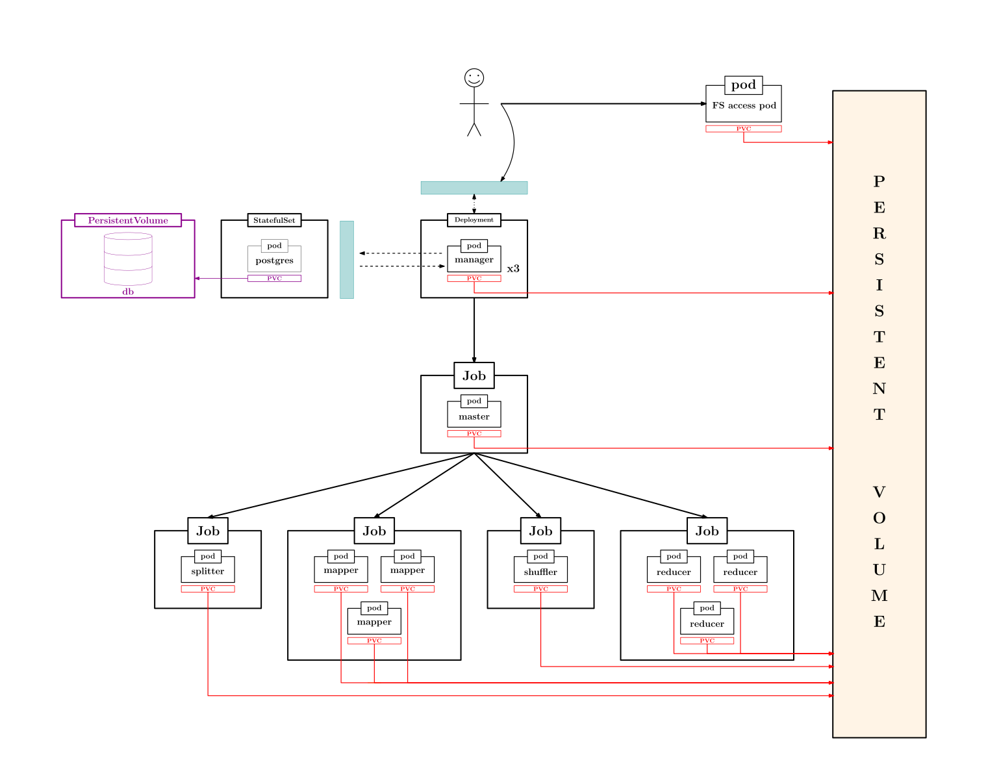

Built with Python 3.12.4

A custom MapReduce implementation on a Kubernetes-managed cluster.

  <figure>
      
      <!-- <figcaption>An elephant at sunset</figcaption> -->
  </figure>

### Presentation & Demo
`<links here>`

### Repository Structure
- <a href="./flask-manager-service/"> **`/flask-manager-service`**</a> contains the implementation of the manager service, which is responsible for handling all user interaction and authentication and creating the master job*

### Dependencies:
| **package / tool** | **purpose** |
|:---:|:---:|
| Kubernetes | Cluster Orchestration & Fault Tolerance |
| Longhorn | Kubernetes Persistent Storage |
| Headlamp | Kubernetes Cluster Monitoring |
| Docker | Containerization |
| Flask | API Development |
| PyJWT | Token-Based Authentication |
| SQLAlchemy| ORM |
| psycopg | DB connection |
| Alembic | DB Migrations |
| PostgreSQL | Database Management |
| HTML, JS, CSS | Web UI |

### MapReduce Paper
The MapReduce paper can be found <a href="https://www.usenix.org/legacy/publications/library/proceedings/osdi04/tech/full_papers/dean/dean.pdf">here</a>.
